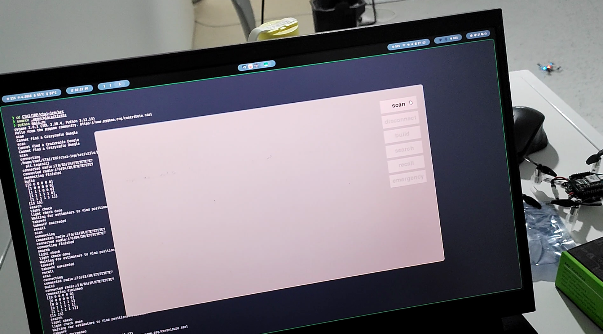
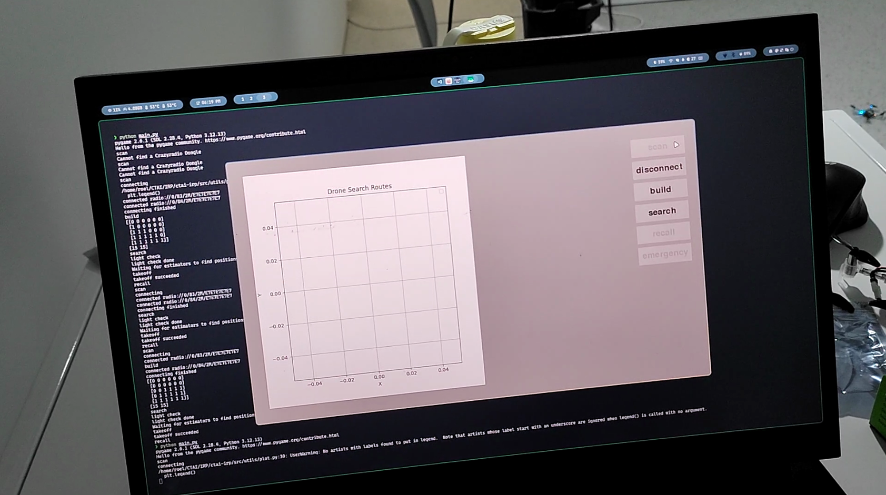
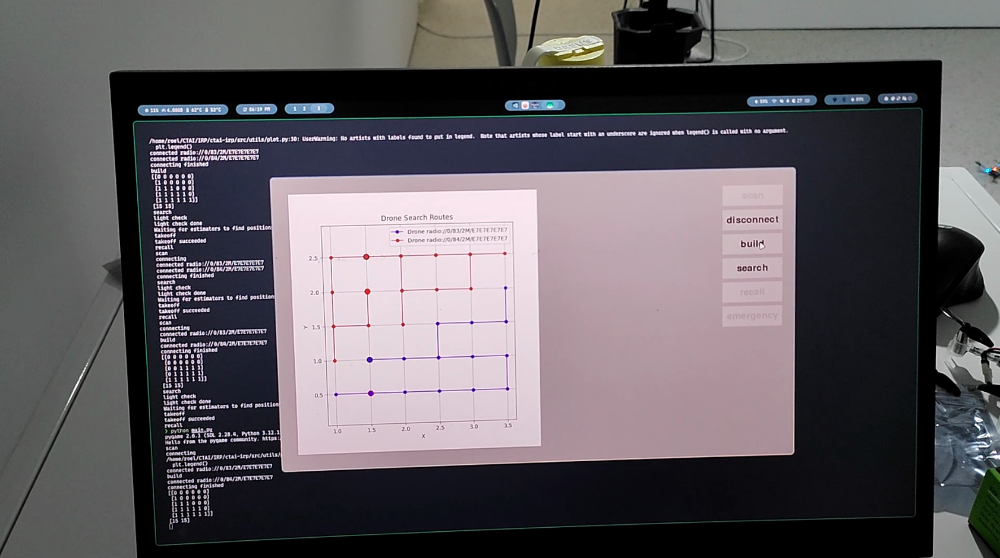
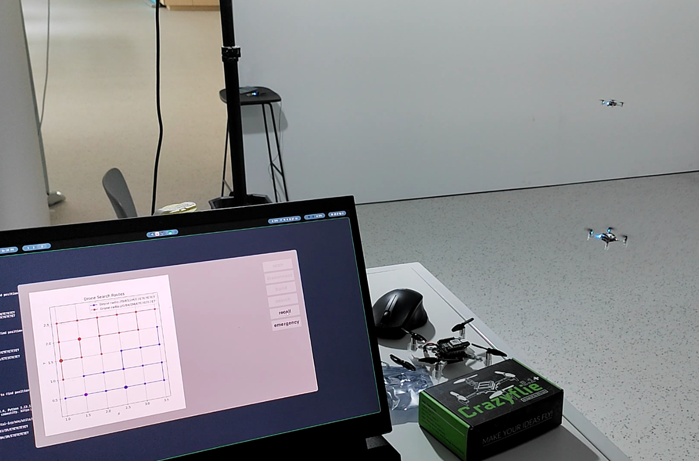
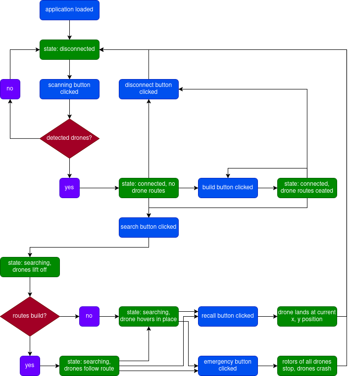

# User Manual

the application starts in a [disconnected](#disconnected-state) state

## Disconnected state

- the **scan** button is available
---
- the user presses the **scan** button
    - no drones are available
        - state does not change
    - one or more drones are available
        - available drones are connected to the system using a radio link ,each connected drone's front left LED starts flickering
        - state changes to [connected (no routes)](#connected-state-no-routes-build)

## Connected state (no routes build)

- the **disconnect**, **build** and **search** buttons are available
- an empty drone search routes graph is displayed
---
- the user presses the **disconnect** button
    - connection to the drones is closed
    - the state changes back to [disconnected](#disconnected-state)
- the user presses the **build** button
    - the state changes to [connected (routes build)](#connected-state-routes-build)
- the user presses the **search** button
    - the state changes to [search](#search-state)

## Connected state (routes build)

- the position of the drones and search area are used to determine the routes that each connected drone needs to follow
---
- the **disconnect**, **build** and **search** buttons are available
- the search routes graph displays displays
    - the start point of each drone
    - the current location of the drone in the search area
    - the route of each drone
---
- the user presses the **disconnect** button
    - connection to the drones is closed
    - the state changes back to [disconnected](#disconnected-state)
- the user presses the **build** button
    - the state changes to [connected (routes build)](#connected-state-routes-build)
- the user presses the **search** button
    - the state changes to [search](#search-state)

## Search state

- **recall** and **emergency** buttons are available
- drone search routes graph is displayed 
---
- each drone's front LEDs trn orange for two seconds
- the drones take a few seconds to callibrate
- the drones take off simultaneously to a set target height
- the drones perform each step of their route, the drone search graph is updated according to their positions
- if there are no steps (remaining) the drone hovers in place
---
- the user presses the **recall** button
    - the drones descend back to ground level in their current position
    - all drones' propellers are stopped
    - ...
- the user presses the **emergency** button
    - the drones' propellers are stopped
    - the drones still in the air crash
    - ...
---
- connection to the drones is closed
- the state changes back to [disconnected](#disconnected-state)

## User Flow

