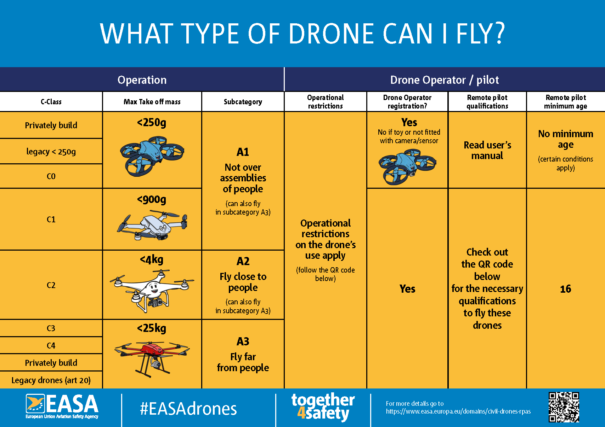
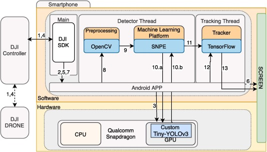
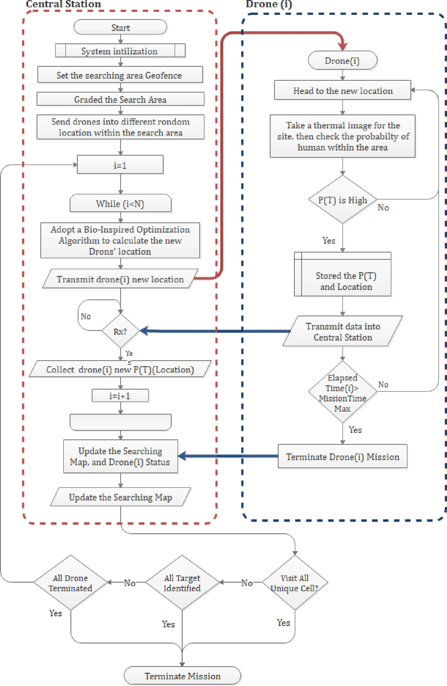
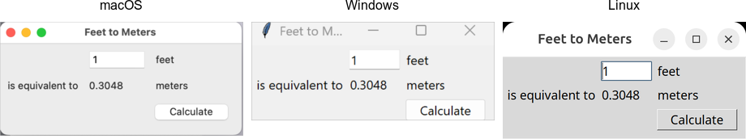

# How can UAV swarm AI be used in search and rescue operations: A literature review.

## Introduction

In recent years there has been an increase in the use of Unmanned Aerial Vehicles (UAV) in search and rescue (SAR) operations (Ops). Compared to human SAR personel a single human piloted UAV can search an area quickly, cheap and without endangering SAR personnel. Using a swarm of UAV's for SAR Ops might offer an even bigger advantage. This literature review aims to provide a basis for technical research and to answer the question: "How can UAV swarm AI be used in search and rescue operations?" To answer this question research has been divided into multiple sub questions.

- What is drone swarm AI?
    - What is a drone?
    - What is swarm AI?
- What are search and rescue operations (SAR Ops)?
- How are drones currently used in SAR Ops?
    - What are the constraints of a drone in SAR Ops?
    - How does a drone detect a target?
    - How does a rescuer receive information from a drone?
- How do drones form a swarm AI?
    - How does a drone cummunicate with another drone?
    - How can the position of a drone relative to ... be determined?
        - the environment
        - another drone
    - Which computations are deployed where?
- What is an easily deployable and fast navigation/exploration algorithm for multiple explorers?
- What are the constraints of a drone swarm AI in SAR Ops?
- How can a drone swarm AI detect a target?
    - How can a drone swarm AI not detect the same target as multiple seperate targets 
- How can a drone swarm ... a central intelligent system and rescuer?
    - receive instructions from
    - relay relevant information to

The goal of the technical research is the following use case. In a large indoor space a three-dimensional perimeter or search area is defined. In this perimeter no obstacles are present at the fleight height of the drones. A user inputs a number of missing targets and sends out the drone swarm to search for these targets using a frontend application. The frontend application shows a 2D ground map with the location of each drone in the search area. When a drone detects a target, the target is shown on the search area map. The user can also recall all the drones at all times.

The following items are required for a minimal viable product:

- an object that simulates a target
- a large indoor space
- an interactive screen
- drones that have a way of capturing images of targets and transfering these images in real time
- a central intelligence that can send instructions to the drones and receive data from the drones.

The use case also calls for infrastructure that can achieve the use case with the necessary items. A decision needs to be made about what this infrastructure will be and how it might function. This ranges from the choices of items to the technologies that support them.

## Key concepts

### UAV

A UAV, commonly referred to as drone is an aircraft that can fly without a pilot onboard. For this literature review it is important to make a distinction between different types of drones and what function they are best used for. Another factor is the legal requirements for operating each type of drone. Requirements and regulations will not be explored further in this review but they will be used for drone classification. The European Union Aviation Safety Agency (EASA) classifies drones based on maximum take of mass (MTOM, the total weight of the drone) and function.

- 'Open' category - low risk [[1](#1)]
    - The 'open' category is the main reference for the majority of leisure drone activities and low-risk commercial activities.
    - 
- Specific category - medium risk [[2](#2)]
    - BVLOS – Beyond Visual Line Of Sight
    - When using a drone with MTOM > 25 kg
    - flying higher than 120m above ground level
    - when dropping material
    - when operating drone in an urban environment with a MTOM> 4 kg or without a class identification label
- Certified category - high risk [[3](#3)]
    - International unmanned cargo aircraft flight
    - Rural or urban drone operations using pre-defined routes carrying passengers or cargo

The EASA also categorises drones based on how they fly. [[4](#4)]

- A fixed-wing drone is essentially a drone with aerodynamic wings that remain fixed during flight for passive lift, similar to a regular airplane. They can stay in the air longer, carry heavier payloads, and exhibit better power efficiency. Control surfaces built into the wing (such as rudders, elevators, and ailerons) enable rotation around three perpendicular axes: vertical (yaw), lateral (pitch), and longitudinal (roll).
- A single-rotor drone (also known as a single-rotor helicopter or gyroplane) features a single large rotor for lift and propulsion. Similar to traditional helicopters, it has a smaller tail rotor to maintain stability and control yaw movement. Single-rotor drones can stay in the air longer and carry heavier payloads compared to multi-rotor designs
- Multi-rotor drones have more than two rotors. They are versatile and widely used for various applications, including mapping, surveillance, and photography.
- Lift and Cruise / Vectored Thrust drones (also known as hybrid drones) feature a combination of rotors and fixed wing and thus merge the benefits of both, offering both endurance and vertical capabilities. This may be achieved by tilting rotors (“vectored thrust”) or independent sets of rotors that point in different directions (“lift and cruise”).

### Swarm AI

A drone swarm is a group of drones that operates in a coordinated manner for: path planning, task assignment, formation control, etc. The collaboration of multiple drones is heavily inspired by nature. In a colony of ants or a hive of bees tasks are assigned to each individual. In a flock of birds each bird uses a very simple set of rules to maintain formation. The rise of Artificial Intelligence (AI) and Machine Learning (ML) can elevate drone swarms to an even more complex level of coordination that goes beyond following basic programs. [[5](#5),[6](#6)]

### SAR Ops [[7](#7)]

**Search**: An operation normally coordinated by a rescue coordination centre or rescue subcentre using available personnel and facilities to locate persons in distress.

**Rescue**: An operation to retrieve persons in distress, provide for their initial medical or other needs, and deliver them to a place of safety.

## Similar studies

### Search and rescue operation using UAVs: A case study [[8](#8)]

#### Methodology & technical choices

In this study three seperate parts are integrated to create a human piloted search and rescue drone.
1. A wireless connection between a DJI drone, controller and a smartphone. High quality images (1080p) are streamed from the camera mounted on the drone to the controller along with drone sensor data. images can be shown and processed on a smartphone connected to the controller via USB cable. Commands are sent from the phone to the drone via the controller. A DJI drone (type not specified) is used for this due to commercial availability and the DJI SDK.
2. A CNN model able to detect people in images taken at high altitudes. An enhoanced Tiny-YOLOv3 model is embedded on the smartphone for real-time detection with high accuracy.
3. An architecture to realise the propsed solution. The architecture can be split in to three key steps.
    1. Image pre-processing with OopenCV due to its strength in image processing
    2. Object detection with the SNPE framework due to its support of GPU acceleration.
    3. Image tracking with Tensorflow as an extra help to show the detected person an a screen.



#### Results

Real life testing of human detection in challenging rural conditions showed that the detection approach achieved 94.73% of mAP and an average of 6.8 FPS when running on a cost-efficient smartphone.

### A bio-inspired swarm UAV framework integrating thermal sensing and optimization-based coordination for efficient search and rescue operations [[9](#9)]

#### Methodology

The proposed method is a multi-drone thermal search system implemented in a simulated environment that replicates real world aerial SAR conditions. The drones follow a distributed decision-making approach, where the search area is divided into grid cells (30m x 60m). Each UAV flies to unexplored regions while maximizing coverage and also avoiding previously explored zones. The overall search process is divided into two primary components:
1. The ground station side, responsible for managing the global search map and computing the best following locations for each UAV using bio-inspired algorithms.
2. The drone side, where each UAV autonomously:
    - flies to its assigned location
    - captures thermal imagery
    - estimates the probvability of human presence with thermal data
    - sends results back to the ground station

Starting from system initialization for high-altitude thermal search, to mission termination, the flow of operations between tyhe two components is summarized in the image below.



#### Technological choices

The simulation environment was built using Gazebo and PX4 autopilo firmware. Each virtual drone is equipped with MAVSDK-Python API (flight control interface) ensuring asynchronous waypoint navigation, telemetry monitoring, and mission management. A GStreamer protocol per drone streams images captured by a downward-facing thermal camera. Finally a detection modules assigns a confidence of human presence score based on pixel intensity per cell covered by its drone. Visualization was handled by the Gazebo simulation to provide a 3D view of the simulation and a QGroundControl, connected via MAVLink, displayed telemetry for each drone.

#### Evaluation metrics

10 bio-inspired optimization algorithm were evaluated in this simulated environment by the following evaluation metrics:
- Time-Based Coverage Ratio: What proportion of the celss have been visited once after a certain time?
- Time-Based Redundancy Ratio: In all the cell visits including repeat visits, how many were a repeat visit after a certain time?
- Time-Based Average Inter-Drone Distance: At a single point in time, if you look at the distance between every possible pair of drones, What is the average distance?
- Total Path Length: What is the sum of the total distance traveled by all drones?
- Exploration Score: What is a metric that combines how well an algorithm covers new areas, avoids redundancy and spreads drones to search broadly?


#### Results

10 bio-inspired optimization algorithms for navigation were tested against eachother in the simulation environment. Particle Swarm Optimization (PSO) offers the most effective trade-off, achieving the highest exploration score and highlighting strong coordination among drones. Crashes are not considered in this study as a 3D layered drone swarm will be explored in further studies.

### Collaborative coverage path planning for UAV swarm for multi-region post-disaster assessment [[10](#10)]

#### Problem definition

In this research three problems are tackled on drone swarm collaboration in a search and rescue context.

- The first objective is how to minimize the number of UAVs. The fewer drones required to complete the objective, the less energy is wasted.
- The second objective is how to minimize the total travel distance of every single drone in the swarm by enhancing coverage of its zone to reduce energy cost.
- The third objective is how to maximize the collaboration synchronization rate of the UAV swarm. This means the efficiency of balanced task assignment to each drone in the swarm. In other words, we avoid using a single individual drone more or less compared to others.

#### Methodology

To research these problems the research uses mathematical algorithms and pseudo code for simulation. Experiments are defined and multiple algorithms are tested. The criteria are corresponding to the objectives.

- Objective 1 criteria: number of drones
- Objective 2 criteria: the sum of the total distance traveled by each drone
- Objective 3 criteria: the variance of the drones' travel distance

The proposed solution is a Coverage Path Planning method based on a particle swarm optimization algorithm (SPSO-CPP).

#### Results

Results show that SPSO-CPP can adapt well to different scenarios, dispatching the fewest UAVs and optimize coverage paths. The algorithm is only meant for missions where the area is already known which is rarely the case in a dissaster scenario. When an area requires more urgent coverage the algorithm is not equipped to handle changes. A drone would need to update the task areas in real-time during the mission and change course while sticking to the original path as much as possible. These limitations have been identified as future areas of research.

## Technology options

### Frontend interface

The frontend interface must display a grid of the search area to show drone and detected target locations along with a button to send out or recall the swarm.

- Pygame [[11](#11)]
    - Pygame is a python package for developping game applications. The game runs in a loop it gives full control of the program execution to the developer. This allows for more control but also adds a layer of complexity for programming.
    ```python
    # Example file showing a basic pygame "game loop"
    import pygame

    # pygame setup
    pygame.init()
    screen = pygame.display.set_mode((1280, 720))
    clock = pygame.time.Clock()
    running = True

    while running:
        # poll for events
        # pygame.QUIT event means the user clicked X to close your window
        for event in pygame.event.get():
            if event.type == pygame.QUIT:
                running = False

        # fill the screen with a color to wipe away anything from last frame
        screen.fill("purple")

        # RENDER YOUR GAME HERE

        # flip() the display to put your work on screen
        pygame.display.flip()

        clock.tick(60)  # limits FPS to 60

    pygame.quit()
    ```

    
- TKinter [[12](#12),[13](#13)]
    - Tkinter is a python package for devlopping cross platform user interfaces. You first define your functions, then you define your visual elements while binding functions to them.
    ```python
    from tkinter import *
    from tkinter import ttk

    def calculate(*args):
        try:
            value = float(feet.get())
            meters.set(round(0.3048 * value, 4))
        except ValueError:
            pass

    root = Tk()
    root.title("Feet to Meters")

    mainframe = ttk.Frame(root, padding=(3, 3, 12, 12))
    mainframe.grid(column=0, row=0, sticky=(N, W, E, S))

    feet = StringVar()
    feet_entry = ttk.Entry(mainframe, width=7, textvariable=feet)
    feet_entry.grid(column=2, row=1, sticky=(W, E))

    meters = StringVar()
    ttk.Label(mainframe, textvariable=meters).grid(column=2, row=2, sticky=(W, E))

    ttk.Button(mainframe, text="Calculate", command=calculate).grid(column=3, row=3, sticky=W)

    ttk.Label(mainframe, text="feet").grid(column=3, row=1, sticky=W)
    ttk.Label(mainframe, text="is equivalent to").grid(column=1, row=2, sticky=E)
    ttk.Label(mainframe, text="meters").grid(column=3, row=2, sticky=W)

    root.columnconfigure(0, weight=1)
    root.rowconfigure(0, weight=1)
    mainframe.columnconfigure(2, weight=1)
    for child in mainframe.winfo_children(): 
        child.grid_configure(padx=5, pady=5)

    feet_entry.focus()
    root.bind("<Return>", calculate)

    root.mainloop()
    ```

    
- Gradio [[14](#14),[15](#15)]
    - Gradio is a python package for developping web interfaces. It also functions by defining your functions and then visual elements but it has prebuilt components.
    ```python
    import gradio as gr

    def greet(name, intensity):
        return "Hello, " + name + "!" * intensity

    demo = gr.Interface(
        fn=greet,
        inputs=["text", gr.Slider(value=2, minimum=1, maximum=10, step=1)],
        outputs=[gr.Textbox(label="greeting", lines=3)],
        api_name="predict"
    )

    demo.launch()
    ```

    

### Multiple drones

The drones must have a camera, a communication device and a localization device to determine its position in a search area. There must also be a programmable drone interface for a central compute system to handle drone coordination.

- DJI Tello EDU [[16](#16)]
    - Tello EDU is a drone suited for education. You can interact with the drone using programming languages such as Scratch, Python, and Swift. It offers 720p HD transmission, 5MP photos, 13-min flight time, 100m flight distance, and hovering.
- Crazyflie [[17](#17)]
    - The Crazyflie 2.1+ is an open source flying development platform weighing 29g. You can interact with the drone using low-latency/long-range radio plugged into a computer. With radio you can either steer using the client application and a controller or using python or C, up to a distance of 1km while in line of sight. A Crazyflie offers 7 minutes of flight time and requires 40 minutes of charging. Multiple decks offered by Bitcraze can be used to extend the capabilities of the Crazyflie.
- DIY with ardupilot and dronekit [[18](#18),[19](#19)]
    - Building drones for the difficult conditions of search and rescue, can help more people in distress. The commanding of a prupose built drone can be handled by Dronekit. It is a python api that allows communication with Ardupilot. Ardupilot is open source firmware that can interact with drone hardware to steer it. Dronekit also has an android api for the creation of apps that can interact with the drones from the ground.

### Central compute system

The central compute system must be portable, manage the frontend application, able to handle the navigation algorithm and coordination of multiple drones and process the images received from the drones.

- Raspberry pi 5 [[20](#20)]
    - The raspberry pi 5 is a small computer that has all the same components a regular pc might have and is a lot smaller. It has a micro hdmi port in order to connect to a screen, usb ports to plug in possible radio devices, Bluetooth LE, WiFi connection.
- Laptop (Dell G15) [[21](#21)]
    - My personal laptop also has the same features but also includes an NVIDIA 3060 GPU.

### Object detection algorithm

The object detection algorithm must be lightweight and fast in order to process all the images.

- Ultralytics YOLO26 [[22](#22)]
    - Ultralytics is a python library that allows developers to easily work with YOLO models and allows easy quantization to ONNX format. YOLO 26 object detection is the latest YOLO model available for use with ultralytics. The Nano version of this model offers 38.9ms CPU ONNX runtime inference.
- MobileNetV3 [[23](#23)]
    - MobilenetV3 is optimized for mobile architrectures and can handle scarce resources. The inference speed of MobileNetV3-Small is 52ms or 43ms if some blocks between channels 4 and 5 are removed using a Google Pixel phone 
- SqueezeDet [[24](#24)]
    - SqueezeDet is a fully convolutional network devolped for object detection in traffic. It has a small model only 7.9MB in size. The inference speed, 57.2 frames per second or 0.017ms inference speed, was achieved using a TITAN X GPU with a batch size of 1.

## Chosen technology

Out off all the technology options, the prototype will be a swarm of Crazyflie drones. A user can send out and recall the swarm using a pygame GUI. Images captured by the drones. Images capture by the drones will be processed by a retrained YOLO26 algorithm. The central compute system will be my laptop.

### Crazyflie drones

The Crazyflie drones were chosen because Howest University of Applied Sciences has provided me with the Crazyflie loco swarm bundle [[25](#25)], 8 AI decks [[26](#26)] and 8 Flow decks v2 [[27](#27)]. Ideally a Crazyflie is fitted with three decks: AI deck, loco positioning deck and flow deck. Unfortunatly the Crazyflie can only have 2 decks mounted at a single time [[28](#28)]. This means we cannot mount the flow deck as the drones position and image stream are more vital to this project. A big positive is that a swarm is easily controllable with python commands [[29](#29)]. A purpose built DIY drone that could handle navigation and detection by itself would of course be preferable because it eleiminates the need for large computation power of the central compute system. This research is limited to what is available for use.

### Pygame GUI

Pygame GUI combines best with the Crazyflie as control over callbacks and UI updates must be well integrated with the telemetry and image stream from the Crazyflie. Control over Crazyflie maneuvering updates is also vital. This will make development a bit more difficult compared to Tkinter and Gradio as they rely in user input for updates. Updating the UI from backend updates is still possible but a bit more difficult to implement.

### YOLO26 Ultralytics

While other object detection models show better metrics in equal or worse conditions, YOLO26 is easily accessible with Ultralytics and offers easy retraining with minimal code. [[30](#30)]

### Laptop

The central compute system requires a lot of compute and must be portable. The raspberry pi does not suffice in this case and thus my laptop must be used.

## Sources

##### [1]
EASA, “Open Category - Low Risk - Civil Drones | EASA,” EASA, Jul. 10, 2024. https://www.easa.europa.eu/en/domains/drones-air-mobility/operating-drone/open-category-low-risk-civil-drones (accessed Apr. 15, 2026).
##### [2]
EASA, “Specific Category - Civil Drones | EASA,” EASA, Jun. 11, 2019. https://www.easa.europa.eu/en/domains/drones-air-mobility/operating-drone/specific-category-civil-drones (accessed Apr. 15, 2026).
##### [3]
EASA, “Certified Category - Civil Drones | EASA,” EASA, 2018. https://www.easa.europa.eu/en/domains/drones-air-mobility/operating-drone/certified-category-civil-drones (accessed Apr. 15, 2026).
##### [4]
EASA, “Drones & eVTOL Designs,” EASA. https://www.easa.europa.eu/en/domains/drones-air-mobility/drones-evtol-designs (accessed Apr. 15, 2026).
##### [5]
M. Ilyas, “Artificial Intelligence for Drone Swarms,” Journal of Systemics, Cybernetics and Informatics, vol. 23, no. 7, pp. 18–22, Dec. 2025, doi: https://doi.org/10.54808/jsci.23.07.18.
##### [6]
Yunes Alqudsi and Murat Makaraci, “UAV swarms: research, challenges, and future directions,” Journal of Engineering and Applied Science, vol. 72, no. 1, Jan. 2025, doi: https://doi.org/10.1186/s44147-025-00582-3.
##### [7]
ICAO, “Search and Rescue Annex 12 to the Convention on International Civil Aviation International Civil Aviation Organization International Standards and Recommended Practices Eighth Edition,” 2004. Accessed: Apr. 15, 2026. [Online]. Available: https://www.pilot18.com/wp-content/uploads/2017/10/Pilot18.com-ICAO-Annex-12-Search-and-Rescue.pdf
##### [8]
I. Martinez-Alpiste, G. Golcarenarenji, Q. Wang, and J. M. Alcaraz-Calero, “Search and rescue operation using UAVs: A case study,” Expert Systems with Applications, vol. 178, p. 114937, Sep. 2021, doi: https://doi.org/10.1016/j.eswa.2021.114937.
##### [9]
A. A. Kareem et al., “A bio-inspired swarm UAV framework integrating thermal sensing and optimization-based coordination for efficient search and rescue operations,” Scientific Reports, vol. 16, no. 1, Dec. 2025, doi: https://doi.org/10.1038/s41598-025-33223-z.
##### [10]
Y. Xiong, Y. Zhou, J. She, and A. Yu, “Collaborative coverage path planning for UAV swarm for multi-region post-disaster assessment,” Vehicular Communications, vol. 53, p. 100915, Jun. 2025, doi: https://doi.org/10.1016/j.vehcom.2025.100915.
##### [11]
Pygame, “Pygame Front Page — pygame v2.0.0.dev15 documentation,” www.pygame.org, Oct. 06, 2025. https://www.pygame.org/docs/ (accessed Apr. 15, 2026).
##### [12]
M. Roseman, “TkDocs Home,” tkdocs.com, Sep. 12, 2025. https://tkdocs.com/ (accessed Apr. 15, 2026).
##### [13]
M. Roseman, “TkDocs Tutorial - A First (Real) Example,” Tkdocs.com, 2024. https://tkdocs.com/tutorial/firstexample.html (accessed Apr. 15, 2026).
##### [14]
Gradio, “Gradio,” gradio.app. https://www.gradio.app/ (accessed Apr. 15, 2026).
##### [15]
G. Team, “The Interface Class,” Gradio.app, 2025. https://www.gradio.app/guides/the-interface-class (accessed Apr. 15, 2026).
##### [16]
Ryze Tech, “Tello Official Website-Shenzhen Ryze Technology Co.,Ltd.,” Ryzerobotics.com, 2026. https://www.ryzerobotics.com/tello-edu?site=brandsite&from=landing_page (accessed Apr. 15, 2026).
##### [17]
Bitcraze, “Crazyflie 2.1+,” Bitcraze Store, 2024. https://store.bitcraze.io/products/crazyflie-2-1-plus (accessed Apr. 15, 2026).
##### [18]
ArduPilot, “Open Source Drone Software. Versatile, Trusted, Open. ArduPilot.,” ardupilot.org, 2024. https://ardupilot.org/ (accessed Apr. 15, 2026).
##### [19]
“About DroneKit,” dronekit-python.readthedocs.io. https://dronekit-python.readthedocs.io/en/latest/about/overview.html (accessed Apr. 15, 2026).
##### [20]
Raspberry Pi Ltd, “Raspberry Pi 5,” 2026. Accessed: Apr. 15, 2026. [Online]. Available: https://pip-assets.raspberrypi.com/categories/892-raspberry-pi-5/documents/RP-008348-DS-6-raspberry-pi-5-product-brief.pdf?disposition=inline
##### [21]
D. US, “Dell G15 5521 Special Edition   Setup and Specifications   | Dell US,” Dell.com, 2018. https://www.dell.com/support/manuals/en-us/g-series-15-5521-laptop/dell-g15-5521-setup-and-specifications/specificaties-van-de-dell-g15-5521-special-edition?guid=guid-7c9f07ce-626e-44ca-be3a-a1fb036413f9&lang=en-us (accessed Apr. 15, 2026).
##### [22]
Ultralytics, “YOLO26 🚀 Coming soon,” Ultralytics.com, Sep. 05, 2025. https://docs.ultralytics.com/models/yolo26/ (accessed Apr. 15, 2026).
##### [23]
A. Howard et al., “Searching for MobileNetV3,” Nov. 2019. Accessed: Apr. 15, 2026. [Online]. Available: https://arxiv.org/pdf/1905.02244
##### [24]
B. Wu et al., “SqueezeDet: Unified, Small, Low Power Fully Convolutional Neural Networks for Real-Time Object Detection for Autonomous Driving,” SqueezeDet: Unified, Small, Low Power Fully Convolutional Neural Networks for Real-Time Object Detection for Autonomous Driving, Jun. 2019, Accessed: Apr. 15, 2026. [Online]. Available: https://arxiv.org/pdf/1612.01051
##### [25]
Bitcraze, “Loco Swarm bundle - Crazyflie 2.1+,” Bitcraze Store, 2025. https://store.bitcraze.io/products/loco-swarm-bundle (accessed Apr. 15, 2026).
##### [26]
Bitcraze, “AI-deck 1.1,” Bitcraze Store, 2021. https://store.bitcraze.io/collections/decks/products/ai-deck-1-1?variant=32485907890263 (accessed Apr. 15, 2026).
##### [27]
Bitcraze, “Flow deck v2,” Bitcraze Store, 2018. https://store.bitcraze.io/collections/decks/products/flow-deck-v2
##### [28]
Bitcraze, “Getting started with expansion decks | Bitcraze,” Bitcraze.io, 2026. https://www.bitcraze.io/documentation/tutorials/getting-started-with-expansion-decks/ (accessed Apr. 15, 2026).
##### [29]
Bitcraze, “Step-by-Step: Swarm Interface | Bitcraze,” Bitcraze.io, 2026. https://www.bitcraze.io/documentation/repository/crazyflie-lib-python/master/user-guides/sbs_swarm_interface/ (accessed Apr. 15, 2026).
##### [30]
Ultralytics, “Detect,” docs.ultralytics.com, Nov. 12, 2023. https://docs.ultralytics.com/tasks/detect/#models (accessed Apr. 15, 2026).