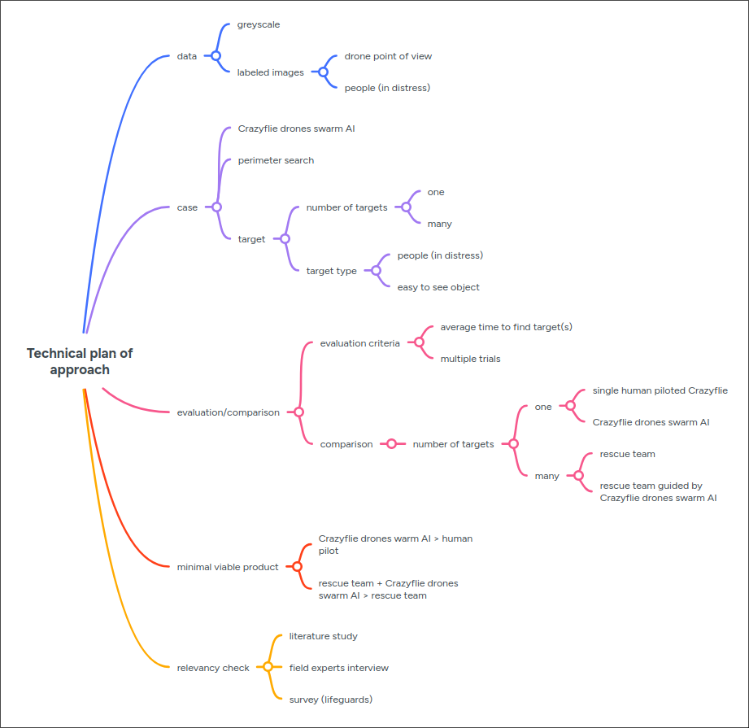

# CONTRACTPLAN RESEARCHPROJECT REMMERIE ROEL

- **bachelor creative technologies & AI**
- **semester 5**
- **academic year 2025-2026**
- **responsibles**
    - **Nathan Segers**
    - **Paula Acuña Roncancio**
    - **Wouter Gevaert**
    

## 1 INTRODUCTION
### 1.1 IDENTIFICATION

|||
|---|---|
| Date | 27/10/2025 |
| Signed by | **Remmerie Roel** |
| Internal coach Research Project | **Paula Acuña Roncancio** |
| Internal promotor bachelor’s Thesis | not determined |
| External promotor bachelor’s Thesis | not determined |

### 1.2 GOAL
In the Innovation & Research Project and Bachelor’s Thesis modules, you will dive deeper into technical
competences and combine them with some general competences. By the end of this module, you’ll be:
- Able to formulate a question from professional field
- Work structured towards a goal
- Get results by own, technical research
- Take conclusions from your technical research
- Reflect on the conclusions
- Formulate advise
- Present your thesis for a jury of specialists
- Create an attitude for Lifelong Learning

How are we going to start?
1. You start by formulating a research question. It could be from an internship company, from an
inspirational list … A team of teachers will check the level of your question.
2. You perform the practical research at school. The question will be fully researched and
technically implemented during the Innovation & Research Project module in a span of
maximum four weeks.
You’ll create/research your own solution/design/prototype. It could be pushed into a specific
direction by your question.
3. In the bachelor’s Thesis you will reflect individually with experts from the industry (for example
in your internship companies) and with community members that have a great knowledge of
your project.

Below, you will find a few of the different steps. Your goal is to think critically about the different phases
of your research. You will create a plan of approach and think about your process. Try to fill in the form
fields as extensively as possible. You will notice that a great and thorough preparation is a great support
during the creation of your research project and bachelor’s thesis.

## 2 PLAN OF APPROACH
### 2.1 SCOUT THE WORKFIELD AND FILTER

You have received your research question from your teachers, from an internship company, from someone else … but now you need to get some more information about this topic. Most likely, you’ll already have a little bit of knowledge about this. In some cases, it’s a completely new topic. Maybe the question that you have received is still too broad, wide, or generic. You’ll have to dive deeper into your topic to get comfortable.

Read, read and read some sources and fetch information. Keep track of all the sources you have encountered during your research. The more you read into your topic, the clearer your vision will get. As it gets clearer, you can easily define your topic further. Narrowing down is very important:
- What exactly are you going to research?
- Where is your topic located?
- What perspective are you going to research?
- Who are the actors that benefit from this research?

### 2.2 REASEARCH QUESTION AND SUBQUESTIONS

This is your main research question: What question do you wish to research and answer?

**What is the best use of drone swarm AI in Search and rescue operations**

### 2.3 SUB QUESTIONS

Write down a bunch of sub questions to structure your project. It will make sure you can split your
research in chunks with theoretical and practical parts. Some questions will be answered by a literature
study. Other questions will only be answered by practically researching everything.

Try to get a minimum of 5 and a maximum of 10 sub questions. It can be a few smaller and some bigger
questions if needed.

- What is drone swarm AI?
    - What is a drone?
    - What is swarm AI?
- Where and When can a drone operate?
- What are search and rescue operations (SAR Ops)?
- How can a drone detect a target
- How can drone swarm AI be used in SAR Ops?
- What are the risks of using drone swarm AI in SAR Ops?
- What are the advantages of using drone swarm AI in SAR Ops?

### 2.4 THE RESEARCH PROJECT – TECHNICAL RESEARCH
Goal: Your research question will be technically implemented individually (or in a team of two people)
during the practical weeks in January, during a period of maximum four weeks. You’ll create/research
your own solution/design/prototype.

This is the first real practical step as soon as you have formulated your research and sub questions.
You clearly defined what way you want to go to, and now you can formulate all the different steps to get
to that goal. What components are necessary to reach your goal? How are you going to build these
components?

TIP: Write down a mind map (or brainstorm) to structure your approach. Talk this through with
experts/your coach.

What are you going to create as technical research? Make sure your context is well defined, go into
detail where necessary. Use a plan of approach and include images. Don’t forget any important
elements! **Warning: Innovation & Research Project in MCT is always a technical realisation. Only including a literature study is not enough.**
- Which data will you use?
    - greyscale images
    - none for non human target
    - for human target
        - search an rescue datasets SARD
        - human detection in UAV imagery
- What case will you work out?
    - A swarm of Crazyflie drones searches a perimeter for: ...
        1. a single non human target ...
        2. multiple non human targets ...
        3. a single person in distress ...
        4. multiple people in distress ...
    
        as efficiently as possible.
- Which evaluation or comparison criteria will you use?
    - always over multiple trials
    1. a single human piloted Crazyflie vs a swarm AI of Crazyflies for a single target, criteria: average time to target over multiple trials.
    2. a group of mock rescuers vs that same group of mock rescuers assisted by the Crazyflie swarm for multiple targets, criteria: average time to targets over multiple trials.
- What are the minimal requirements of your project / app?
    - a swarm AI of Crazyflies that can find a single non human target more efficiently then a single human pilot.
- How do you make sure your application is relevant?
    - literature study
    - interview with field experts
    - survey (colleagues lifeguards Bredene)

### 2.5 TECHNICAL RESEARCH: SUCCESS CRITERIA
Now that you have well defined how your project will be made, it is important to define some goals and
success criteria.
- When is your project finished according to your standards? Describe a few of your results that you want to achieve. Use a list.
    - [ ] drones can detect targets
    - [ ] drones can communicate with eachother (swarm AI)
    - [ ] drones explore the perimeter
        - using search algorithms
        - coordinating with swarm AI
    - [ ] drones can execute case [1.](), **A swarm of Crazyflie drones searches a perimeter for a single target faster than a human operated drone**
        - extra use cases [2.]() [3.]() [4.]()

- What will your technical demo or proof-of-concept contain?
    - executing (or showing a video of) the last completed use case 
- When is your project finished?
    - after completing use case [4.]()
- What if you’re done in a few weeks, and you want to do some alternatives?
    - as mentioned previously: extra use cases [2.]() [3.]() [4.]()

## Sources

#### SEARCH AND RESCUE IMAGE DATASET FOR PERSON DETECTION - SARD.
- S. Sambolek, M. Ivasic-Kos. "SEARCH AND RESCUE IMAGE DATASET FOR PERSON DETECTION - SARD." SEARCH AND RESCUE IMAGE DATASET FOR PERSON DETECTION - SARD | IEEE DataPort. Accessed: Feb. 16, 2026. [Online.] Available: https://ieee-dataport.org/documents/search-and-rescue-image-dataset-person-detection-sard
#### Automatic Person Detection in Search and Rescue Operations Using Deep CNN Detectors.
- S. Sambolek, M. Ivasic-Kos. "Automatic Person Detection in Search and Rescue Operations Using Deep CNN Detectors." Automatic Person Detection in Search and Rescue Operations Using Deep CNN Detectors | IEEE Journals & Magazine | IEEE Xplore. Accessed: Feb. 16, 2026. [Online.] Available: https://ieeexplore.ieee.org/document/9369386
#### Unicamp-UAV: An open dataset for human detection in UAV imagery.
- D. P. Simões, H. C. de Oliveira, D. R. Pereira. "Unicamp-UAV: An open dataset for human detection in UAV imagery." Unicamp-UAV: An open dataset for human detection in UAV imagery - ScienceDirect. Accessed: Feb. 16, 2026. [Online.] Available: https://www.sciencedirect.com/science/article/pii/S0924271625004149
#### Loco Swarm bundle - Crazyflie 2.1+.
- "Loco Swarm bundle - Crazyflie 2.1+." Loco Swarm bundle - Crazyflie 2.1+ – Bitcraze Store. Accessed: Feb. 16, 2026. [Online.] Available: https://store.bitcraze.io/products/loco-swarm-bundle
#### AI deck 1.1.
- "AI deck 1.1." AI deck 1.1 | Bitcraze. Accessed: Feb. 16, 2026. [Online.] Available: https://www.bitcraze.io/products/ai-deck/
#### Flow deck v2.
- "Flow deck v2." Flow deck v2 | Bitcraze. Accessed: Feb. 16, 2026. [Online.] Available: https://www.bitcraze.io/products/flow-deck-v2/
